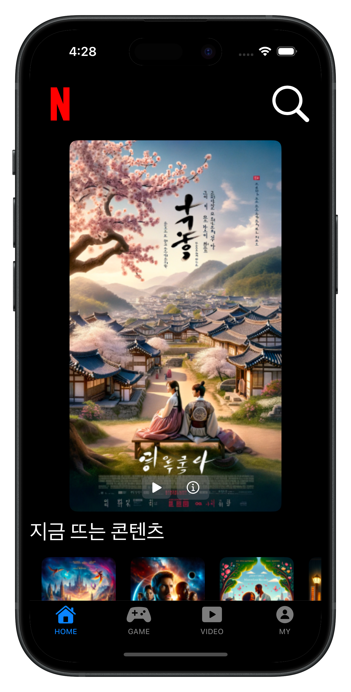
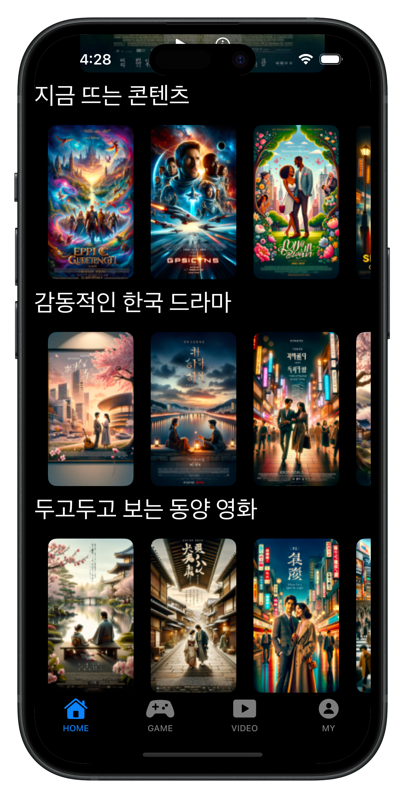
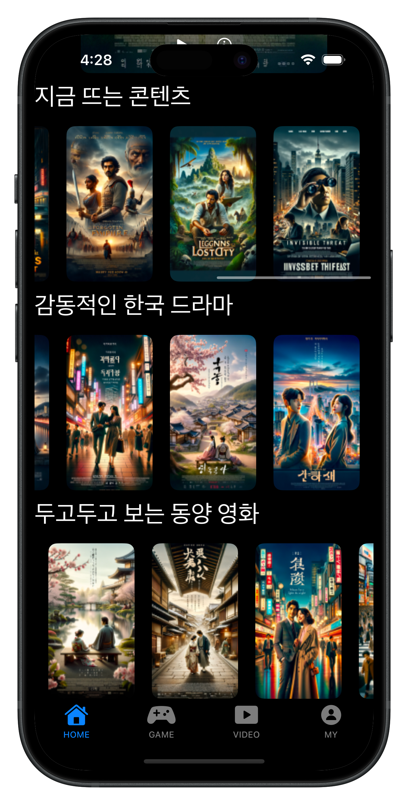

# 🎬 iOS NetFlixTumbnail App

This is a basic iOS app created by following [https://www.inflearn.com/ja/course/진짜-왕초보-ios-swiftui].

This is an iOS app that connects to a server and renders UI based on images and data stored on AWS (Amazon Web Services).  
Poster images were generated with ChatGPT (some text may look strange).  

---

  
  
  

## 📘 What I Learned  

### Swift Basics  
- How to connect to a server using **URLSession**  
- Parsing JSON with **JSONDecoder**  

### SwiftUI Concepts  
- Displaying remote images with **AsyncImage**  
- Using **if statements** inside views for conditional UI  
- Building tab-based navigation with **TabView**  
- Showing loading states with **ProgressView**  

---

## ✨ Features  
- **Feature 1:** Fetch poster data from AWS in real time  
- **Feature 2:** Display thumbnails in a Netflix-like UI  
- **Feature 3:** Show loading indicators while fetching data  

---

# 🎬 Netflix サムネイルアプリ  

このアプリはサーバーに接続し、AWS（Amazon Web Services）に保存されている画像・データに基づいて画面を描画します。  
ポスター画像は ChatGPT で生成されたため、文字が奇妙になる場合があります。  

---

## 📕学んだこと  

### Swift文法知識  
- **URLSession** を使ったネットワーク通信  
- **JSONDecoder** でJSONデータをパース  

### SwiftUIコンセプト  
- **AsyncImage** で非同期に画像を表示  
- View 内で **if文** を使った条件分岐  
- **TabView** を使ったタブ切り替え  
- **ProgressView** で読み込み中を表示  

---

## ✨ 機能  
- **機能1:** AWSからポスター情報をリアルタイム取得  
- **機能2:** Netflix風のサムネイル表示  
- **機能3:** 読み込み中はローディングインジケーターを表示  

